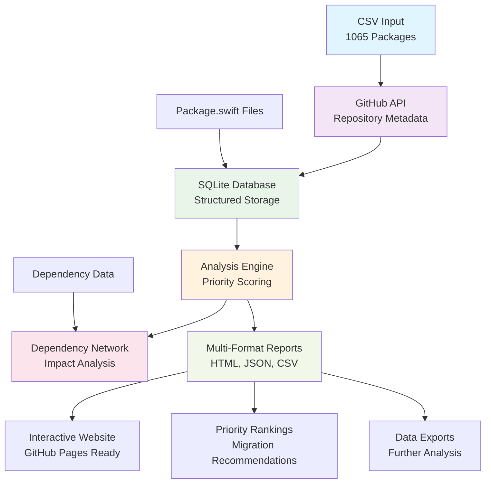

# Swift Package Android Migration Analysis

A data analysis tool for the [Swift Android Working Group](https://www.swift.org/ecosystem/android/) that analyzes **1065 Swift packages** to prioritize Android migration efforts. Identifies Linux-compatible packages that lack Android support and provides data-driven migration recommendations.

## Quick Start

```bash
# Setup (one-time)
./scripts/setup.sh
python swift_analyzer.py --setup

# Collect data
python swift_analyzer.py --collect --test  # Small test batch
python swift_analyzer.py --collect         # Full collection

# Generate analysis
python swift_analyzer.py --analyze         # Complete reports & visualizations

# Check results
python swift_analyzer.py --status
```

## What It Does

- **Analyzes 1065 Swift packages** that support Linux but not Android
- **Prioritizes migration targets** using GitHub stars, forks, and dependency impact
- **Maps dependency networks** to identify high-impact packages
- **Generates interactive reports** with visualizations and migration recommendations
- **Exports data** in HTML, JSON, and CSV formats for community use

## Data Flow Overview



## Requirements

- Python 3.11+ (recommended for best compatibility)
- GitHub token (recommended for higher API limits)

## Installation

```bash
git clone <repository-url>
cd spm-android-support-tracking
./scripts/setup.sh
```

**Manual setup:**
```bash
python3.11 -m venv .venv
source .venv/bin/activate
pip install -r requirements.txt
cp .env.example .env  # If .env.example exists
# Add GitHub token to .env: GITHUB_TOKEN=your_token_here
python swift_analyzer.py --setup
```

## Usage

### Basic Workflow
```bash
# Collect repository data
python swift_analyzer.py --collect --test                 # Test with 3 repos
python swift_analyzer.py --collect --batch-size 10        # Process 10 at a time
python swift_analyzer.py --collect                        # Full collection

# Generate analysis and reports
python swift_analyzer.py --analyze                        # All reports and exports

# Check status
python swift_analyzer.py --status                         # Processing status
```

### Commands

| Command | Description |
|---------|-------------|
| `--setup` | Initialize database |
| `--collect` | Fetch GitHub data |
| `--analyze` | Generate reports |
| `--status` | Show progress |

### Collection Options

| Flag | Description |
|------|-------------|
| `--test` | Process 3 repositories (testing) |
| `--batch-size N` | Set batch size (default: 40) |
| `--max-batches N` | Limit number of batches |

### Analysis Options

| Flag | Description |
|------|-------------|
| `--output-dir` | Set output directory (default: exports) |

## Output

**Generated files:**
- `exports/index.html` - GitHub Pages site with interactive features
- `exports/comprehensive_report.html` - Detailed analysis report
- `exports/comprehensive_report.json` - Structured data export
- `exports/priority_analysis.csv` - Migration priority rankings
- `exports/swift_packages.csv` - Complete repository data
- `exports/swift_packages.json` - Repository data in JSON format
- `exports/dependencies/` - Dependency network analysis
- `exports/dependency_visualizations/` - Interactive dependency graphs

**Features:**
- Interactive dependency network graphs
- Priority rankings with detailed rationale
- Repository cards with GitHub/Swift Package Index links
- Executive summary with key metrics
- Complete data exports for further analysis

## GitHub Pages Deployment

```bash
# Generate all reports including web site
python swift_analyzer.py --analyze

# Deploy (enable GitHub Pages in repo settings)
git add exports/index.html
git commit -m "Add analysis site"
git push origin main
```

Site will be available at: `https://username.github.io/repository-name/`

## Configuration

**Environment variables** (`.env`):
- `GITHUB_TOKEN` - GitHub API token (recommended)
- `DATABASE_URL` - Database path (optional)

**Rate limits:**
- With token: 5000 requests/hour
- Without token: 60 requests/hour

## Architecture

**Priority scoring considers:**
- GitHub stars and forks (40% weight)
- Community engagement - forks + watchers (30% weight)
- Recent activity - based on last push (20% weight)
- Low dependency complexity - easier migration (10% weight)

## Project Structure

```
├── swift_analyzer.py               # Single entry point CLI
├── swift_package_analyzer/         # Core package
│   ├── cli/                       # Command interfaces
│   ├── core/                      # Config & models
│   ├── data/                      # GitHub API integration
│   ├── analysis/                  # Analysis logic
│   ├── output/                    # Report generation
│   └── templates/                 # HTML templates
├── data/linux-compatible-android-incompatible.csv
├── requirements.txt
└── exports/                       # Generated outputs
```

## Troubleshooting

**Common issues:**
- **Rate limits:** Add GitHub token to `.env`
- **Import errors:** Activate virtual environment: `source venv/bin/activate`
- **Database errors:** Reinitialize: `python swift_analyzer.py --setup`
- **Empty results:** Verify CSV file exists and network connectivity

**Debug commands:**
```bash
python swift_analyzer.py --status         # Check database state
python swift_analyzer.py --collect --test # Test with small batch
```

## Example Output

```bash
$ python swift_analyzer.py --status
=== Processing Status ===
📊 Repositories in database: 156 / 1065
⭐ Average stars: 1,247
📈 Processing complete: 14.6%
🕒 Last update: 2 hours ago
```

---

*Supporting Swift's expansion to Android through data-driven migration prioritization.*