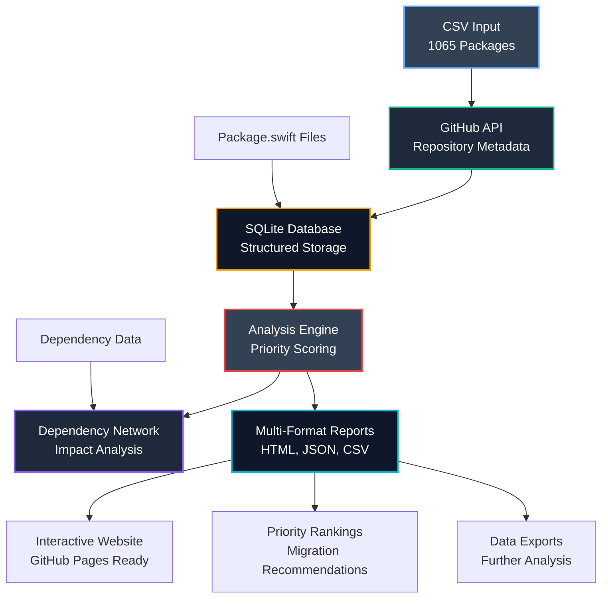

# Swift Package Android Migration Analysis

A data analysis tool for the [Swift Android Working Group](https://www.swift.org/android-workgroup/) that analyzes **1065 Swift packages** to prioritize Android migration efforts. Identifies Linux-compatible packages that lack Android support and provides data-driven migration recommendations.

## Quick Start

```bash
# Setup environment file
echo "GITHUB_TOKEN=your_token_here" > .env

# Python setup and usage
./scripts/setup.sh && python swift_analyzer.py --setup
python swift_analyzer.py --collect
python swift_analyzer.py --analyze
```

## What It Does

- **Analyzes 1065 Swift packages** that support Linux but not Android
- **Prioritizes migration targets** using GitHub stars, forks, and dependency impact
- **Maps dependency networks** to identify high-impact packages
- **Generates interactive reports** with visualizations and migration recommendations
- **Automated nightly updates** via GitHub Actions (250 repos/night, ~4 day refresh cycle)
- **Exports data** in HTML, JSON, and CSV formats for community use

## Data Flow Overview



## Installation

**Requirements:** Python 3.11+

```bash
git clone <repository-url>
cd spm-android-support-tracking
echo "GITHUB_TOKEN=your_token_here" > .env

# Setup
./scripts/setup.sh
# OR: python3.11 -m venv .venv && source .venv/bin/activate && pip install -r requirements.txt
```

## Usage

| Command | Description |
|---------|-------------|
| `--setup` | Initialize database |
| `--collect` | Fetch GitHub data (`--test` for 3 repos) |
| `--collect --chunked` | Chunked refresh (recommended for automation) |
| `--analyze` | Generate reports |
| `--status` | Show progress and freshness |

```bash
python swift_analyzer.py --setup
python swift_analyzer.py --collect --test                        # Test with 3 repos
python swift_analyzer.py --collect --batch-size 10               # Custom batch size
python swift_analyzer.py --collect --chunked --batch-size 250    # Chunked refresh (250 repos)
python swift_analyzer.py --analyze --output-dir docs
```

## Output

**Generated files:**
- `docs/index.html` - GitHub Pages site with interactive features
- `docs/priority_analysis.csv` - Migration priority rankings
- `docs/swift_packages.csv` - Complete repository data
- `docs/swift_packages.json` - Repository data in JSON format
- `docs/dependencies/` - Dependency network analysis

**Features:**
- Interactive dependency network graphs
- Priority rankings with detailed rationale
- Repository cards with GitHub/Swift Package Index links
- Executive summary with key metrics
- Complete data exports for further analysis

## Configuration

**Environment variables** (`.env`):
- `GITHUB_TOKEN` - GitHub API token (5000 req/hr vs 60 req/hr without)
- `DATABASE_URL` - Database path (optional)

**Priority scoring:** Stars/forks (40%), engagement (30%), recent activity (20%), low complexity (10%)

## Project Structure

```
├── swift_analyzer.py               # Single entry point CLI
├── swift_package_analyzer/         # Core package
│   ├── cli/                       # Command interfaces
│   ├── core/                      # Config & models
│   ├── data/                      # GitHub API integration
│   ├── analysis/                  # Analysis logic
│   ├── output/                    # Report generation
│   └── templates/                 # HTML templates
├── data/linux-compatible-android-incompatible.csv
├── requirements.txt
└── docs/                          # Generated outputs
```

## Troubleshooting

- **Rate limits:** Add GitHub token to `.env`
- **Import errors:** Activate venv: `source .venv/bin/activate`  
- **Database errors:** Reinitialize: `python swift_analyzer.py --setup`
- **Debug:** Use `--status` and `--test` flags

## Example Output

```bash
$ python swift_analyzer.py --status
Repository Processing Status:
  Total repositories: 1065
  Completed: 1065
  Errors: 0
  Pending: 0

Repository Insights:
  Average stars: 321.5
  Repositories with Package.swift: 1064
  Package.swift coverage: 99.9%

$ python swift_analyzer.py --collect --chunked --batch-size 250
Running simplified chunked data collection...

Chunked collection completed:
  Processed: 250 repositories
  Success: 248
  Errors: 2
  Total available: 1065
  Success rate: 99.2%

Repository freshness:
  Fresh (< 1 day): 250
  Recent (1-7 days): 815
  Stale (> 7 days): 0
  Never fetched: 0
```

---

*Supporting Swift's expansion to Android through data-driven migration prioritization.*