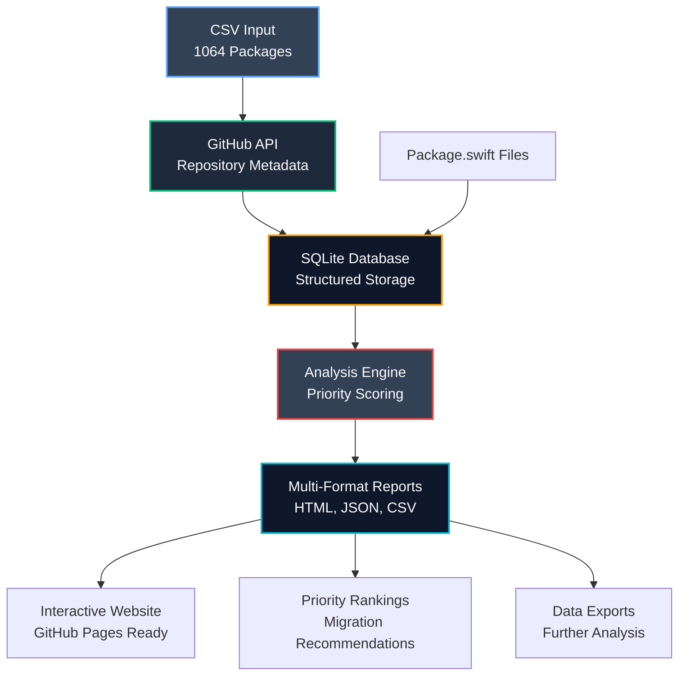

# Swift Package Android Migration Analysis

A data analysis tool for the [Swift Android Working Group](https://www.swift.org/android-workgroup/) that analyzes **1064 Swift packages** to prioritize Android migration efforts. Identifies Linux-compatible packages that lack Android support and provides data-driven migration recommendations.

## Quick Start

```bash
# Setup environment file
echo "GITHUB_TOKEN=your_token_here" > .env

# Setup and usage
./scripts/setup.sh && python swift_analyzer.py --setup
python swift_analyzer.py --collect
python swift_analyzer.py --analyze
```

## Features

- **Analyzes 1064 Swift packages** that support Linux but not Android
- **Prioritizes migration targets** using GitHub stars, forks, and dependency impact
- **Generates comprehensive reports** with data exports and migration recommendations
- **Automated nightly analysis** via GitHub Actions
- **Exports data** in HTML, JSON, and CSV formats for community use

## Data Flow Overview



## Installation

**Requirements:** Python 3.11+

```bash
git clone https://github.com/Jake-Prickett/spm-android-support-tracking.git
cd spm-android-support-tracking
echo "GITHUB_TOKEN=your_token_here" > .env

# Setup
./scripts/setup.sh
# OR: python3 -m venv .venv && source .venv/bin/activate && pip install -r requirements.txt
```

## Usage

| Command | Description |
|---------|-------------|
| `--setup` | Initialize database |
| `--collect` | Fetch GitHub data with smart chunked processing |
| `--collect --test` | Test run with 3 repositories |
| `--analyze` | Generate comprehensive analysis and reports |
| `--status` | Show processing status and repository freshness |

```bash
python swift_analyzer.py --setup
python swift_analyzer.py --collect --test          # Test with 3 repos
python swift_analyzer.py --collect --batch-size 250 # Large batch refresh
python swift_analyzer.py --analyze
```

## Output

**Generated files:**
- `docs/index.html` - GitHub Pages redirect to Next.js frontend
- `docs/swift_packages.csv` - Complete repository data export (1065 lines)
- `docs/swift_packages.json` - Repository data in JSON format (20K+ lines)

**Features:**
- Priority rankings with detailed rationale
- Repository cards with GitHub/Swift Package Index links
- Executive summary with key metrics
- Complete data exports for further analysis

## Interactive Frontend

The project includes a **Next.js web interface** that provides an interactive way to explore the analysis results:

```bash
cd frontend
npm install
npm run dev    # Development server at http://localhost:3000
npm run build  # Production build for GitHub Pages
```

**Frontend Features:**
- 🔍 **Search and filter** repositories by name, description, or criteria
- 📊 **Interactive repository cards** with GitHub stars, forks, and Android status
- 🏷️ **Status tagging** system to visualize Android compatibility
- 📱 **Responsive design** optimized for desktop and mobile
- 🚀 **Auto-deployment** to GitHub Pages when analysis data updates

The frontend automatically loads data from the Python analysis tool and provides a user-friendly interface for exploring migration opportunities.

## Configuration

**Environment variables** (`.env`):
- `GITHUB_TOKEN` - GitHub API token (5000 req/hr vs 60 req/hr without)
- `DATABASE_URL` - Database path (optional)

## Project Structure

```
├── swift_analyzer.py               # Single entry point CLI
├── src/                            # Core Python modules
│   ├── config.py                  # Configuration management
│   ├── models.py                  # Data models
│   ├── fetcher.py                 # GitHub API integration
│   ├── analyzer.py                # Analysis algorithms
│   ├── dependencies.py            # Dependency analysis
│   └── cli.py                     # CLI utilities
├── frontend/                       # Next.js web interface
│   ├── src/components/            # React components
│   ├── src/app/                   # Next.js app router
│   └── public/                    # Static assets
├── data/linux-compatible-android-incompatible.csv
├── requirements.txt
└── docs/                          # Generated analysis outputs
```

## Troubleshooting

- **Rate limits:** Add GitHub token to `.env`
- **Import errors:** Activate venv: `source .venv/bin/activate`  
- **Database errors:** Reinitialize: `python swift_analyzer.py --setup`
- **Debug:** Use `--status` and `--test` flags

## Example Output

```bash
$ python swift_analyzer.py --status
Repository Processing Status:
  Total repositories: 1064
  Completed: 1064
  Errors: 0
  Pending: 0

$ python swift_analyzer.py --collect --batch-size 250
Running simplified chunked data collection...

Chunked collection completed:
  Processed: 250 repositories
  Success: 248
  Errors: 2
  Success rate: 99.2%
```

---

*Supporting Swift's expansion to Android through data-driven migration prioritization.*