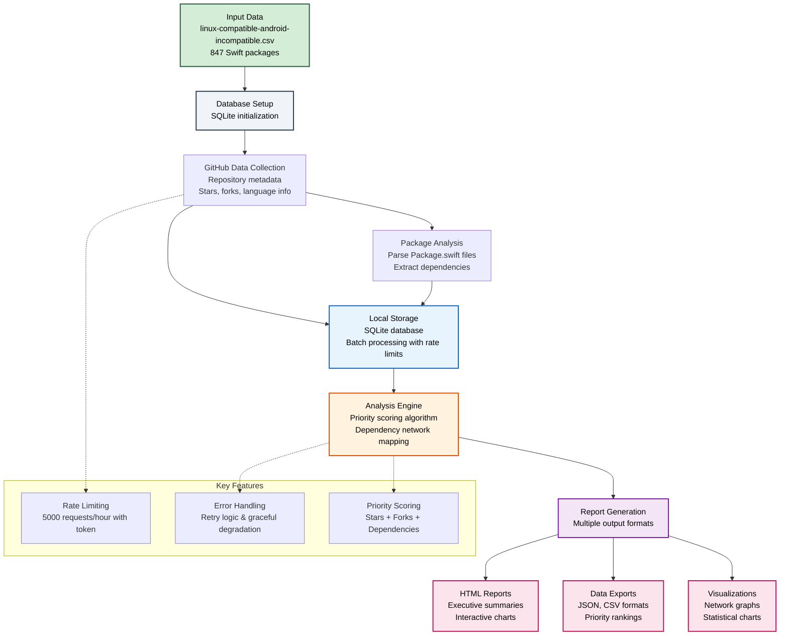
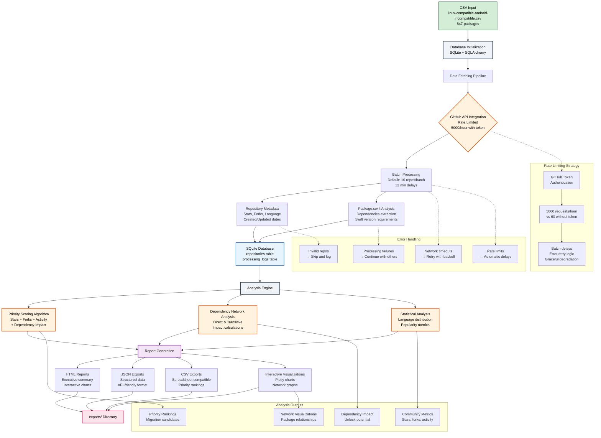

# Swift Package Android Migration Analysis

A comprehensive data analysis tool supporting the [Swift Android Working Group](https://github.com/swift-android/swift-android-working-group) initiative to prioritize Swift package migrations for Android compatibility. This tool analyzes 847 Swift packages that currently support Linux but lack Android support, providing data-driven insights to guide migration efforts.

## Project Goals

The Swift Android Working Group aims to accelerate Swift's adoption on Android by enabling existing Swift packages to work seamlessly across platforms. This tool contributes by:

- **Identifying High-Impact Packages**: Analyze popularity metrics, dependency relationships, and community engagement to prioritize which packages would unlock the most value when migrated
- **Mapping Package Dependencies**: Build comprehensive dependency graphs to understand migration cascades and identify foundational packages
- **Providing Data-Driven Insights**: Generate detailed reports with priority rankings, impact analysis, and migration recommendations
- **Supporting Community Efforts**: Create accessible visualizations and reports that help maintainers and contributors understand migration opportunities

## Overview

This analysis tool processes 847 Swift packages from the Swift Package Index that support Linux but not Android, providing:

- Repository popularity analysis from GitHub metadata
- Dependency network mapping and impact analysis  
- Multi-factor priority scoring for migration efforts
- Interactive reports and visualizations
- Comprehensive data exports for community use

## Data Flow Overview



## Architecture and Features

### Core Components

- **GitHub API Integration**: Automated repository metadata collection with intelligent rate limiting (5000 requests/hour with authentication)
- **SQLite Database**: Local storage with SQLAlchemy ORM for efficient data management and analysis
- **Package.swift Analysis**: Automated parsing to extract dependencies, Swift version requirements, and compatibility information
- **Priority Scoring Algorithm**: Multi-factor ranking system considering stars, forks, dependency impact, and recent activity
- **Dependency Network Analysis**: Graph-based analysis to identify high-impact packages and migration cascades
- **Interactive Report Generation**: Professional HTML reports with embedded visualizations and GitHub Pages compatibility
- **Multiple Export Formats**: JSON, CSV, and HTML outputs optimized for different stakeholders and use cases
- **Batch Processing Pipeline**: Respectful API usage with automatic retry logic and comprehensive error handling

### Technical Architecture

The tool follows a modular architecture designed for scalability and maintainability:

```
Data Ingestion → API Collection → Storage → Analysis → Report Generation
     ↓              ↓              ↓         ↓            ↓
   CSV Input    GitHub Metadata   SQLite   Priority    Multi-format
   847 packages  Rate Limited     Local DB  Scoring     Exports
```

### Priority Scoring Methodology

The priority scoring algorithm considers multiple factors to rank packages by migration value:

1. **Community Adoption**: GitHub stars and fork counts indicate package popularity and adoption
2. **Dependency Impact**: Packages with many dependents unlock more value when migrated
3. **Maintenance Activity**: Recent commits and releases suggest active maintenance
4. **Technical Readiness**: Presence of Package.swift files and Swift version compatibility
5. **Network Effects**: Position in dependency graph and potential cascade effects

Scores are normalized to 0.0-1.0 range with detailed rationale provided for each package.

## Setup

### Prerequisites
- Python 3.8 or later
- GitHub personal access token (recommended for higher API limits)

### Installation

1. **Clone and setup environment:**
   ```bash
   git clone <repository-url>
   cd swift-package-support-data-processing
   
   # Use the automated setup script
   ./setup.sh
   ```

2. **Manual setup (alternative):**
   ```bash
   # Create virtual environment
   python3 -m venv venv
   source venv/bin/activate 
   
   # Install dependencies
   pip install -r requirements.txt
   
   # Configure environment
   cp .env.example .env
   # Edit .env and add your GitHub token (optional but recommended)
   ```

3. **Get GitHub Token (Recommended):**
   - Visit: https://github.com/settings/tokens
   - Create token with `public_repo` scope
   - Add to `.env` file: `GITHUB_TOKEN=your_token_here`
   - **Benefit**: 5000 API requests/hour vs 60 without token

### Initialize Database
```bash
python main.py init-db
```

## Usage

### Data Collection
```bash
# Test with small batch (recommended first run)
python main.py fetch-data --batch-size 5 --max-batches 1

# Process larger datasets
python main.py fetch-data --batch-size 10 --max-batches 5

# Process all repositories (respects rate limits)
python main.py fetch-data
```

### Analysis and Reporting
```bash
# Quick statistics overview
python analyze.py stats

# Comprehensive HTML report with interactive charts
python analyze.py comprehensive --output-dir exports

# Dependency network analysis
python analyze.py dependencies --output-dir exports/dependencies

# Export data in various formats
python main.py export --format csv --output data.csv
python main.py export --format json --output data.json
```

### Check Status
```bash
# View processing status and database statistics
python main.py status
```

### GitHub Pages Generation
```bash
# Generate GitHub Pages compatible site
python analyze.py github-pages --output-dir exports

# Alternative: Generate via reports.py
python reports.py --github-pages --output-dir exports

# Generate comprehensive reports and GitHub Pages in one command
python analyze.py comprehensive --output-dir exports
python analyze.py github-pages --output-dir exports
```

## GitHub Pages Deployment

Generate a complete analysis website for public sharing:

```bash
# Generate GitHub Pages site
python analyze.py github-pages --output-dir exports

# Deploy to repository root
python analyze.py github-pages --output-dir .
git add index.html
git commit -m "Add analysis site"
git push origin main
```

**Enable GitHub Pages**: Repository Settings → Pages → Deploy from branch → main/root

Your site will be available at: `https://username.github.io/repository-name/`

The generated `index.html` includes all visualizations, data exports, and interactive charts in a single self-contained file.

## Command Reference

### Main Commands (`main.py`)
| Command | Description | Example |
|---------|-------------|---------|
| `init-db` | Initialize database tables | `python main.py init-db` |
| `fetch-data` | Collect repository data from GitHub | `python main.py fetch-data --batch-size 10` |
| `status` | Show processing statistics | `python main.py status` |
| `export` | Export data to CSV/JSON | `python main.py export --format csv` |
| `schedule-runner` | Run scheduled batch processing | `python main.py schedule-runner` |

### Analysis Commands (`analyze.py`)
| Command | Description | Example |
|---------|-------------|---------|
| `stats` | Quick overview statistics | `python analyze.py stats` |
| `comprehensive` | Full HTML/JSON reports | `python analyze.py comprehensive` |
| `report` | JSON analysis report | `python analyze.py report --output report.json` |
| `visualize` | Generate charts | `python analyze.py visualize --output-dir charts` |
| `priorities` | Priority ranking analysis | `python analyze.py priorities --limit 25` |
| `dependencies` | Dependency network analysis | `python analyze.py dependencies` |
| `github-pages` | Generate GitHub Pages site | `python analyze.py github-pages --output-dir exports` |

### Report Generation (`reports.py`)
| Command | Description | Example |
|---------|-------------|---------|
| `reports.py` | Direct comprehensive reports | `python reports.py --output-dir exports` |
| `reports.py --github-pages` | Generate GitHub Pages site | `python reports.py --github-pages --output-dir exports` |

## Project Structure

The project follows a standard Python package structure for improved maintainability and modularity:

```
├── main.py                      # Main CLI entry point
├── analyze.py                   # Analysis CLI entry point  
├── reports.py                   # Reports CLI entry point
├── swift_package_analyzer/      # Core package
│   ├── __init__.py
│   ├── cli/                     # Command-line interfaces
│   │   ├── __init__.py
│   │   ├── main.py              # Main CLI commands
│   │   └── analyze.py           # Analysis CLI commands
│   ├── core/                    # Core configuration and models
│   │   ├── __init__.py
│   │   ├── config.py            # Configuration management
│   │   └── models.py            # Database models (SQLAlchemy)
│   ├── data/                    # Data fetching and processing
│   │   ├── __init__.py
│   │   └── fetcher.py           # GitHub API integration
│   ├── analysis/                # Analysis logic
│   │   ├── __init__.py
│   │   ├── analyzer.py          # Core data analysis
│   │   └── dependencies.py     # Dependency network analysis
│   ├── output/                  # Report generation and visualization
│   │   ├── __init__.py
│   │   └── reports.py           # Comprehensive report generation
│   └── templates/               # HTML templates
│       └── github_pages_template.html
├── requirements.txt             # Python dependencies
├── .env.example                # Environment template
├── setup.sh                    # Automated setup script
├── linux-compatible-android-incompatible.csv  # Input data
├── swift_packages.db           # SQLite database
├── logs/                       # Application logs
└── exports/                    # Generated outputs
    ├── comprehensive_report.html
    ├── comprehensive_report.json
    ├── priority_analysis.csv
    ├── interactive_charts/
    └── dependency_visualizations/
```

### Architecture Benefits

- **Modular Design**: Clear separation of concerns with dedicated modules for CLI, data processing, analysis, and output
- **Standard Python Structure**: Follows Python packaging conventions for better maintainability
- **Import Clarity**: Explicit imports reduce dependency confusion and improve code navigation
- **Scalability**: Easy to extend with new analysis features or output formats

## Output Formats

### HTML Reports
- Executive summary with key metrics
- Interactive charts and visualizations
- Top priority repositories with detailed analysis
- Professional styling and responsive design

### Interactive Visualizations
- **Stars vs Forks Scatter Plot**: Repository popularity analysis
- **Language Distribution Charts**: Programming language breakdown
- **Priority Rankings**: Top packages for migration
- **Dependency Networks**: Interactive package relationship graphs

### Data Exports
- **CSV**: Spreadsheet-compatible data with priority scores
- **JSON**: Structured data for programmatic access
- **Charts**: PNG/HTML interactive visualizations

### Dependency Analysis
- **Network Graphs**: Interactive dependency relationships
- **Impact Analysis**: Shows migration unlock potential  
- **Tree Visualizations**: Hierarchical dependency structures
- **Priority Metrics**: Data-driven migration recommendations

## Configuration

### Environment Variables (`.env`)
- `GITHUB_TOKEN`: Personal access token for GitHub API (recommended)
- `DATABASE_URL`: SQLite database path (optional)

### Rate Limiting
- **With Token**: 5000 API requests/hour
- **Without Token**: 60 API requests/hour  
- **Batch Processing**: Automatic delays between requests
- **Error Recovery**: Retry logic for transient failures

### Processing Settings
- **Default Batch Size**: 10 repositories per batch
- **Default Delay**: 12 minutes between batches
- **Error Handling**: Continues processing despite individual failures
- **Progress Tracking**: Real-time progress bars and statistics

## Example Output

### Status Check
```bash
$ python main.py status
Repository Processing Status:
  Total repositories: 156
  Completed: 143
  Errors: 13
  Success rate: 91.7%
```

### Analysis Report Sample
```bash
$ python analyze.py stats
=== SWIFT PACKAGE ANALYSIS SUMMARY ===
Total Repositories: 156
Average Stars: 1,247
Most Popular: Alamofire/Alamofire (40K stars)
Primary Language: Swift (89.2%)
API Success Rate: 94.7%
```

## Troubleshooting

### Common Issues

**Import/Dependency Errors:**
```bash
# Ensure virtual environment is activated
source venv/bin/activate  # or venv\Scripts\activate on Windows
pip install -r requirements.txt
```

**Rate Limit Warnings:**
- Add GitHub token to `.env` file for higher limits
- Reduce `--batch-size` for slower processing

**Database Errors:**
```bash
# Reinitialize database if needed
python main.py init-db
```

**Empty Results:**
- Verify `linux-compatible-android-incompatible.csv` exists
- Check network connection for GitHub API access

### Getting Help
- Check logs in `logs/` directory for detailed error information
- Use `python main.py status` to verify database state
- Test with small batches first: `--batch-size 5 --max-batches 1`

## Technical Details

### Detailed Data Pipeline



### Architecture Components

- **Data Ingestion**: CSV parsing and URL extraction
- **API Integration**: GitHub REST API with intelligent rate limiting
- **Storage Layer**: SQLite database with SQLAlchemy ORM
- **Analysis Engine**: Multi-factor priority scoring and dependency mapping
- **Export System**: Multiple output formats for different use cases
- **Error Recovery**: Comprehensive retry logic and graceful degradation

## Contributing

This project supports the [Swift Android Working Group](https://github.com/swift-android/swift-android-working-group) initiative to bring Swift to Android. Contributions welcome for enhanced analysis features, visualizations, and performance improvements.

## Acknowledgments

This project supports the Swift Android Working Group's mission to accelerate Swift adoption on Android through systematic package migration analysis. Special thanks to the Swift Package Index team for maintaining comprehensive package metadata.