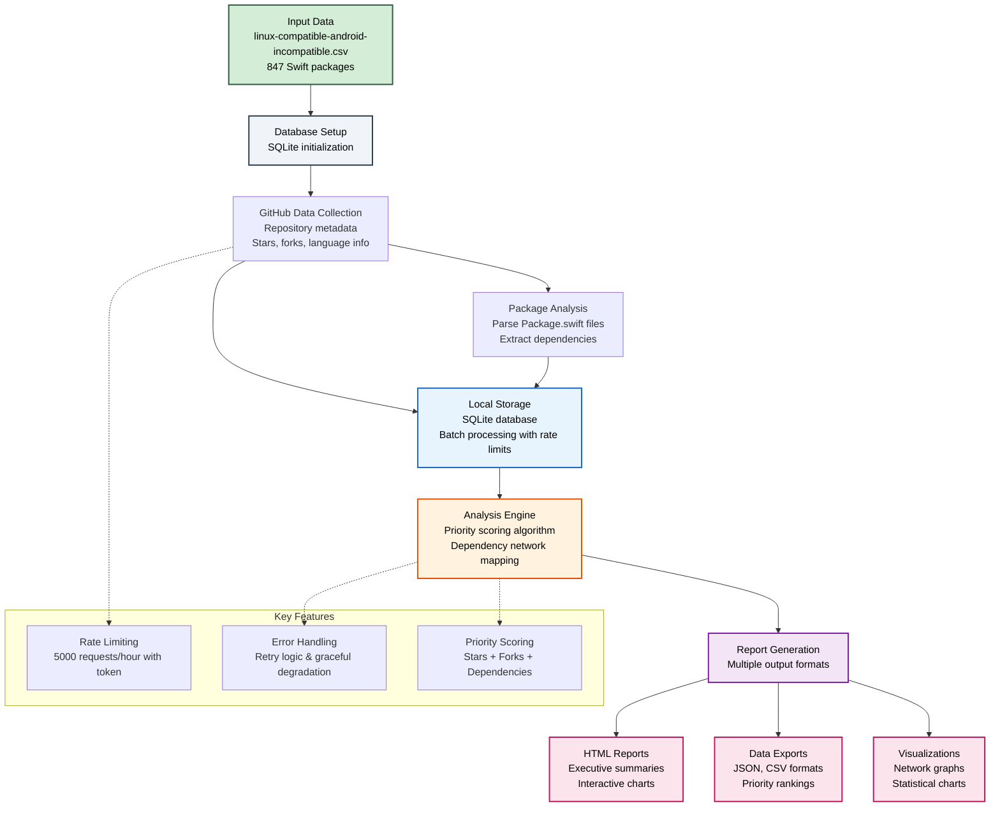
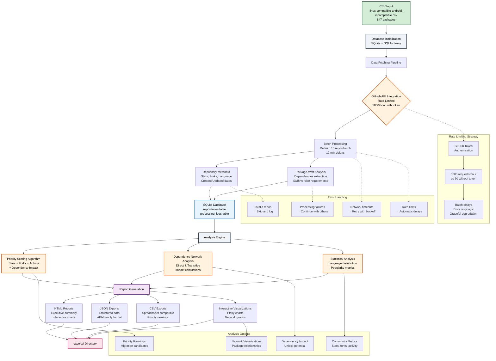

# Swift Package Support Data Processing

A data analysis tool for the Swift Android Working Group that analyzes Swift packages currently supporting Linux but lacking Android support. This tool helps prioritize migration efforts by analyzing repository popularity, dependencies, and community engagement.

## Overview

This project processes 1000+ Swift packages from the Swift Package Index to:
- 📊 Analyze repository popularity and community metrics from GitHub
- 🔍 Identify high-impact packages for Android compatibility migration
- 🕸️ Map dependency relationships between packages
- 🎯 Generate priority rankings based on data-driven insights
- 📈 Create comprehensive reports and interactive visualizations

## Data Flow Overview



## Features

- **GitHub API Integration**: Fetch repository metadata with intelligent rate limiting
- **SQLite Database**: Local storage for efficient analysis of package data
- **Package.swift Parsing**: Extract dependencies and Swift version requirements
- **Priority Scoring**: Multi-factor algorithm ranking packages by migration value
- **Interactive Reports**: HTML reports with charts and dependency visualizations
- **Multiple Export Formats**: JSON, CSV, and HTML outputs for different use cases
- **Batch Processing**: Respectful API usage with progress tracking
- **Dependency Analysis**: Network graphs showing package relationships

## Setup

### Prerequisites
- Python 3.8 or later
- GitHub personal access token (recommended for higher API limits)

### Installation

1. **Clone and setup environment:**
   ```bash
   git clone <repository-url>
   cd swift-package-support-data-processing
   
   # Use the automated setup script
   ./setup.sh
   ```

2. **Manual setup (alternative):**
   ```bash
   # Create virtual environment
   python3 -m venv venv
   source venv/bin/activate 
   
   # Install dependencies
   pip install -r requirements.txt
   
   # Configure environment
   cp .env.example .env
   # Edit .env and add your GitHub token (optional but recommended)
   ```

3. **Get GitHub Token (Recommended):**
   - Visit: https://github.com/settings/tokens
   - Create token with `public_repo` scope
   - Add to `.env` file: `GITHUB_TOKEN=your_token_here`
   - **Benefit**: 5000 API requests/hour vs 60 without token

### Initialize Database
```bash
python main.py init-db
```

## Usage

### Data Collection
```bash
# Test with small batch (recommended first run)
python main.py fetch-data --batch-size 5 --max-batches 1

# Process larger datasets
python main.py fetch-data --batch-size 10 --max-batches 5

# Process all repositories (respects rate limits)
python main.py fetch-data
```

### Analysis and Reporting
```bash
# Quick statistics overview
python analyze.py stats

# Comprehensive HTML report with interactive charts
python analyze.py comprehensive --output-dir exports

# Dependency network analysis
python analyze.py dependencies --output-dir exports/dependencies

# Export data in various formats
python main.py export --format csv --output data.csv
python main.py export --format json --output data.json
```

### Check Status
```bash
# View processing status and database statistics
python main.py status
```

## Command Reference

### Main Commands (`main.py`)
| Command | Description | Example |
|---------|-------------|---------|
| `init-db` | Initialize database tables | `python main.py init-db` |
| `fetch-data` | Collect repository data from GitHub | `python main.py fetch-data --batch-size 10` |
| `status` | Show processing statistics | `python main.py status` |
| `export` | Export data to CSV/JSON | `python main.py export --format csv` |
| `schedule-runner` | Run scheduled batch processing | `python main.py schedule-runner` |

### Analysis Commands (`analyze.py`)
| Command | Description | Example |
|---------|-------------|---------|
| `stats` | Quick overview statistics | `python analyze.py stats` |
| `comprehensive` | Full HTML/JSON reports | `python analyze.py comprehensive` |
| `report` | JSON analysis report | `python analyze.py report --output report.json` |
| `visualize` | Generate charts | `python analyze.py visualize --output-dir charts` |
| `priorities` | Priority ranking analysis | `python analyze.py priorities --limit 25` |
| `dependencies` | Dependency network analysis | `python analyze.py dependencies` |

### Report Generation (`reports.py`)
| Command | Description | Example |
|---------|-------------|---------|
| `reports.py` | Direct comprehensive reports | `python reports.py --output-dir exports` |

## Project Structure

```
├── main.py                      # Main CLI interface
├── analyze.py                   # Analysis and visualization CLI  
├── reports.py                   # Comprehensive report generation
├── dependency_analyzer.py       # Dependency network analysis
├── config.py                    # Configuration management
├── models.py                    # Database models (SQLAlchemy)
├── fetcher.py                   # GitHub API integration
├── analyzer.py                  # Core data analysis
├── requirements.txt             # Python dependencies
├── .env.example                # Environment template
├── setup.sh                    # Automated setup script
├── linux-compatible-android-incompatible.csv  # Input data
├── swift_packages.db           # SQLite database
├── logs/                       # Application logs
├── data/                       # Raw data files
└── exports/                    # Generated outputs
    ├── comprehensive_report.html
    ├── comprehensive_report.json
    ├── priority_analysis.csv
    ├── interactive_charts/
    └── dependency_visualizations/
```

## Output Formats

### HTML Reports
- Executive summary with key metrics
- Interactive charts and visualizations
- Top priority repositories with detailed analysis
- Professional styling and responsive design

### Interactive Visualizations
- **Stars vs Forks Scatter Plot**: Repository popularity analysis
- **Language Distribution Charts**: Programming language breakdown
- **Priority Rankings**: Top packages for migration
- **Dependency Networks**: Interactive package relationship graphs

### Data Exports
- **CSV**: Spreadsheet-compatible data with priority scores
- **JSON**: Structured data for programmatic access
- **Charts**: PNG/HTML interactive visualizations

### Dependency Analysis
- **Network Graphs**: Interactive dependency relationships
- **Impact Analysis**: Shows migration unlock potential  
- **Tree Visualizations**: Hierarchical dependency structures
- **Priority Metrics**: Data-driven migration recommendations

## Configuration

### Environment Variables (`.env`)
- `GITHUB_TOKEN`: Personal access token for GitHub API (recommended)
- `DATABASE_URL`: SQLite database path (optional)

### Rate Limiting
- **With Token**: 5000 API requests/hour
- **Without Token**: 60 API requests/hour  
- **Batch Processing**: Automatic delays between requests
- **Error Recovery**: Retry logic for transient failures

### Processing Settings
- **Default Batch Size**: 10 repositories per batch
- **Default Delay**: 12 minutes between batches
- **Error Handling**: Continues processing despite individual failures
- **Progress Tracking**: Real-time progress bars and statistics

## Example Output

### Status Check
```bash
$ python main.py status
Repository Processing Status:
  Total repositories: 156
  Completed: 143
  Errors: 13
  Success rate: 91.7%
```

### Analysis Report Sample
```bash
$ python analyze.py stats
📊 Swift Package Analysis Summary
├── Total Repositories: 156
├── Average Stars: 1,247
├── Most Popular: Alamofire/Alamofire (40K stars)
└── Top Language: Swift (89.2%)
```

## Troubleshooting

### Common Issues

**Import/Dependency Errors:**
```bash
# Ensure virtual environment is activated
source venv/bin/activate  # or venv\Scripts\activate on Windows
pip install -r requirements.txt
```

**Rate Limit Warnings:**
- Add GitHub token to `.env` file for higher limits
- Reduce `--batch-size` for slower processing

**Database Errors:**
```bash
# Reinitialize database if needed
python main.py init-db
```

**Empty Results:**
- Verify `linux-compatible-android-incompatible.csv` exists
- Check network connection for GitHub API access

### Getting Help
- Check logs in `logs/` directory for detailed error information
- Use `python main.py status` to verify database state
- Test with small batches first: `--batch-size 5 --max-batches 1`

## Technical Details

### Detailed Data Pipeline



### Architecture Components

- **Data Ingestion**: CSV parsing and URL extraction
- **API Integration**: GitHub REST API with intelligent rate limiting
- **Storage Layer**: SQLite database with SQLAlchemy ORM
- **Analysis Engine**: Multi-factor priority scoring and dependency mapping
- **Export System**: Multiple output formats for different use cases
- **Error Recovery**: Comprehensive retry logic and graceful degradation

## Contributing

This project supports the Swift Android Working Group initiative. Contributions welcome for:
- Enhanced Package.swift parsing capabilities
- Additional interactive visualizations  
- Performance optimizations
- Web dashboard development
- Migration tracking features

## License

See LICENSE file for details.

---

**Goal**: Accelerate Swift's Android ecosystem by prioritizing high-impact package migrations through data-driven insights! 🚀